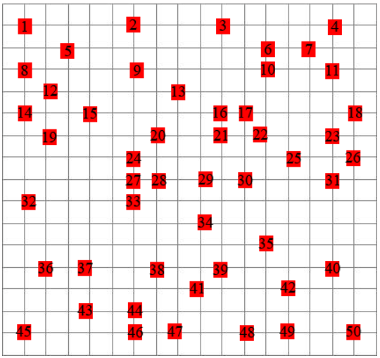
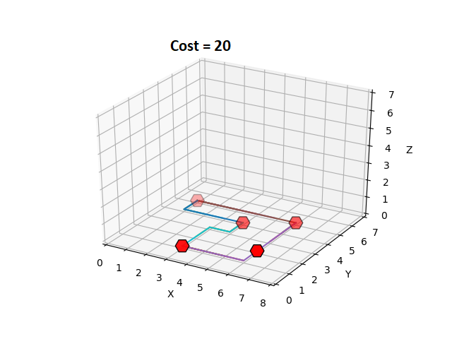
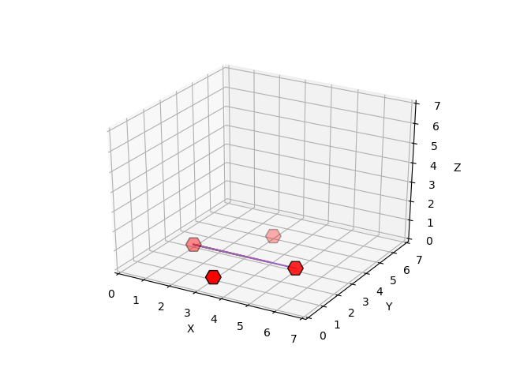
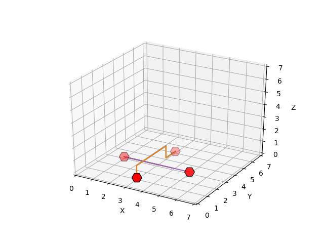
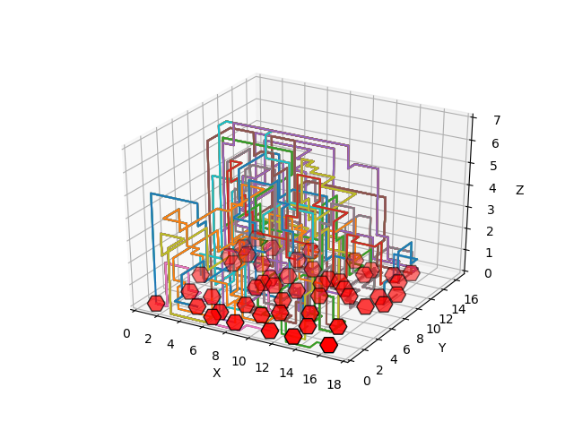
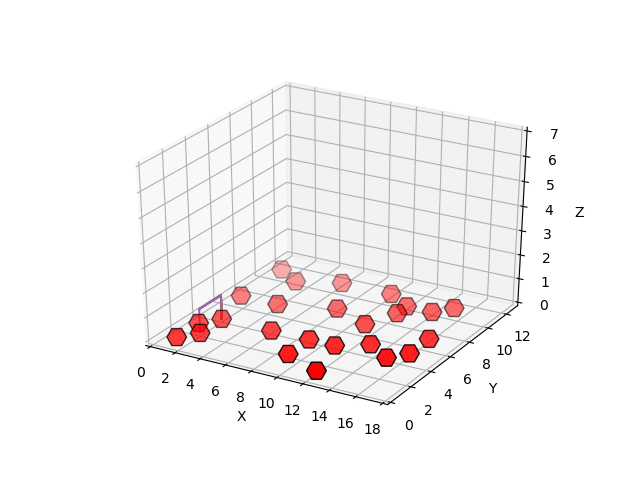
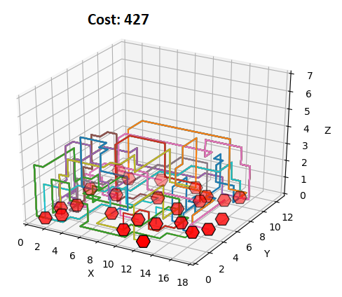

# Sjips
## Chips & Circuits

## Auteurs
* Emma Caarls
* Lisa Geers
* Marte van der Wijk

# Wat moet er in de read me
README
Voor de README kijken we o.a. naar:

De case waar de studenten mee bezig geweest zijn is duidelijk geïntroduceerd in de README.
De aanpak van de verschillende algoritmen is duidelijk beschreven in de README.
Het is na lezen van de README duidelijk hoe de resultaten te reproduceren zijn, via een interface (command line), argumenten die meegegeven kunnen worden voor de verschillende functionaliteiten/algoritmen, of bijvoorbeeld een duidelijke uitleg welke file te runnen om welk resultaat te krijgen.
#

### Uitleg van de case:

Bij chips & circuits is het de bedoeling gates op een chip te verbinden met zo kort mogelijke kabels, die elkaar en de gates niet kruisen.  Welke gates verbonden moeten worden staat vast in een netlist. De chip wordt weergegeven als grid met de x- en y-dimensies zo dat er één extra rand om de buitenste gates om ligt. Er kan in de z-richting zeven lagen worden uitgebreid, om meer kabels te kunnen leggen. Kabels mogen alleen via de gridlijnen bewegen. Elke stap tussen coördinaten kost 1. Wanneer een kabel niet gelegd kan worden, worden daar extra kosten voor in rekening gebracht.




***Figuur 1)** Voorbeeldchip. Deze gates moeten met elkaar verbonden worden.*



***Figuur 2)** Voorbeeldnetlist, waarbij de gates met elkaar verbonden zijn met de laagste kosten (20)*


Het voorbeeld in Figuur 2 is makkelijk op te lossen met 2D-bewegingen. Het korste pad op een othogonaal grid heet de manhattan distance. In Figuur 1 is te zien dat dit snel verkeerd kan gaan; kabels zouden moeten kruisen bij enkel 2D-bewegingen naar hun doel. Dit probleem is in Figuur 3 weergegeven.




***Figuur 3)** Visualisatie van het probleem wanneer alleen in de x- en y-richting bew0gen mag worden.*


Om meer gates met elkaar te kunnen verbinden kunnen extra lagen in de z-richting worden toegevoegd, maximaal zeven. Figuur 4 laat zien hoe in de z-richting bewogen kan worden, waardoor kruising voorkomen wordt.




***Figuur 4)** Kabels kunnen ook in de z-richting bewegen, waardoor ze andere kabels niet hoeven te kruisen.*

Figuur 4 is relatief eenvoudig opgelost met deze maatregel, maar de aanpak van een chip zoals Figuur 1 vereist meer maatregelen. In Figuur 5 is diezelfde chip te zien waarbij gebruik wordt gemaakt van meerdere lagen. Toch is hier pas zestig procent van de te leggen kabels gelegd. 




***Figuur 5)** In deze afbeelding is slechts zestig procent van de te leggen kabels gelegd. De overige veertig procent van de kabels loopt ergens vast, waardoor verbinden niet meer lukt.*


### Structuur

Alle classes en algoritmen staan in de folder Code. Alle input waardes zitten in de folder Data en alle resultaten zitten in de folder Resultaten.

### Vereisten

Deze codebase is volledig geschreven in Python 3.7. In requirements.txt staan alle benodigde packages om de code succesvol uit te voeren. Deze zijn te installeren via pip met het volgende commando:

```
pip install -r requirements.txt
```

### Gebruik
Het programma kan gerund worden door het aanroepen van:

```
python main.py
```

Bij het runnen van het programma krijgt de gebruiker verschillende opties. Bij elke keuze die een gebruiker kan maken staat duidelijk waaruit de gebruiker kan kiezen:
- Maak een keuze welke chip je wil gebruiken.
- Maak een keuze welke netlist je wil gebruiken.
- Maak een keuze hoe je de netlist gesorteerd wilt hebben.
- Maak een keuze welk algoritme je wil kiezen.
- Afhankelijk van welk algoritme gekozen maak je een keuze of je gebruik wilt maken van Hill Climber en Loose_layering.
- Maak een keuze welke heuristiek je wilt gebruiken.


Wanneer je al deze keuzes gemaakt hebt krijg je een **output**:
- Een matplotlib met hoe de kabels gelegd zijn met verschillende kleuren voor verschillende kabels. 
- Hoeveel kabels er gelegd zijn van het aantal te leggen kabels.
- De totale kosten.
- Een csv-bestand met per net een lijst van alle coördinaten van de kabel tussen de gates.

In Figuur 6 is te zien hoe de kabels van een netlist één voor één gelegd worden. Figuur 7 laat de output zien zoals deze weergegeven wordt na het runnen van main.py. De kosten zijn er in dit geval handmatig bijgezet, normaliter worden de kosten weergegeven in de terminal.



***Figuur 6)** In deze gif is te zien hoe de kabels één voor één gelegd worden. Deze gif is uitgevoerd op chip 1, netlist 1 (te vinden in de folder Data) met devolgende instellingen: most_common, astar, distance_to_gate, hill climber, loose_layering (allemaal te vinden in de folder Code).*




***Figuur 7)** Output afbeelding die weergegeven wordt na het runnen van main.py.*


## Problemen met github
* De laptop van Marte is de eerste dag van het vak (maandag 6 januari 2020) kapot gegaan. Hierdoor heeft Marte de eerste week weinig kunnen pushen en pullen via github. Deze dagen heeft ze wel veel meegewerkt.
* Lisa pushte eerst met een andere naam (de naam van haar laptop: Vince). Hier kwamen we pas eind van de eerste week achter, waardoor het lijkt alsog ook Lisa niet gupusht en gepulled had. Dit was wel zo.
